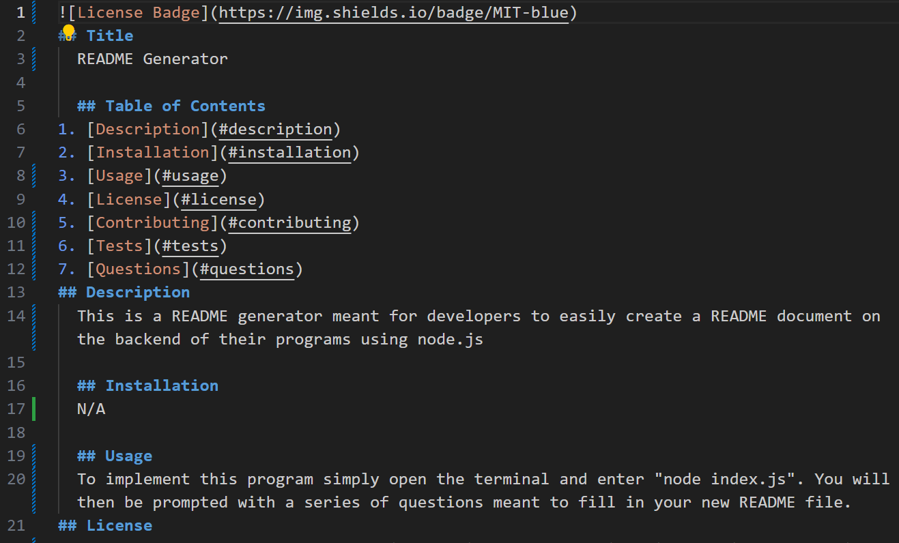
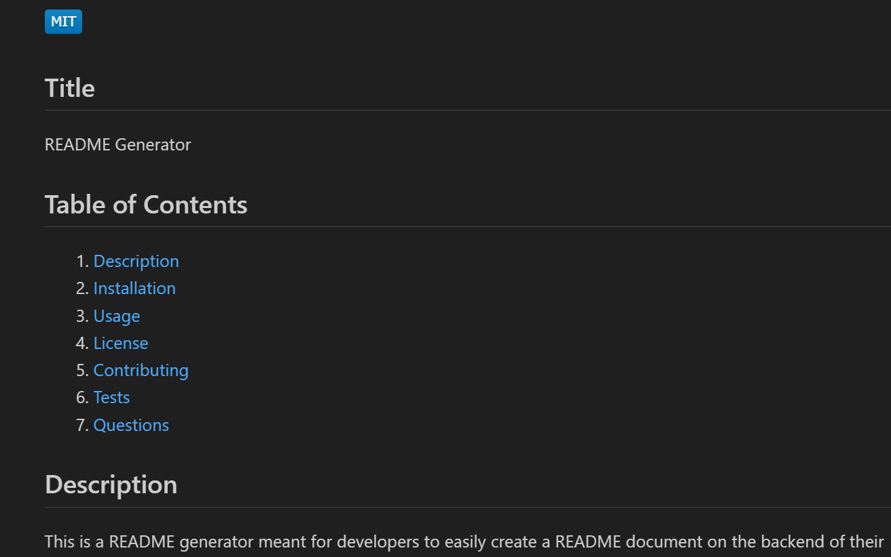

## README-Generator

## Description
This is a README generator that is meant to create new README files easily by developers on the backend of their programs via node.js

## Badges
N/A

## Visuals

Follow the link for a video walkthrough of this program.
"https://drive.google.com/file/d/1Sy-ag0DksCMeagPLn8jdKbe-tbFgRLbN/preview" 

## Usage
In order to use this generator, open a terminal from the index.js file. Type in "node index.js" and then be faced with a series of questions. Once you answer all of these questions, a README will be generated for you. Once you view the README you will see a badge showing your license at the top followed by a table of contents. You can click on each item in the table of contents and be taken to that section.

## Contributing
N/A

## Authors and acknowledgment
This project was writted by myself, Ida Whitcomb, starting with code given to me by the UNH Bootcamp staff.

## License
N/A

## Project status
This project is complete.